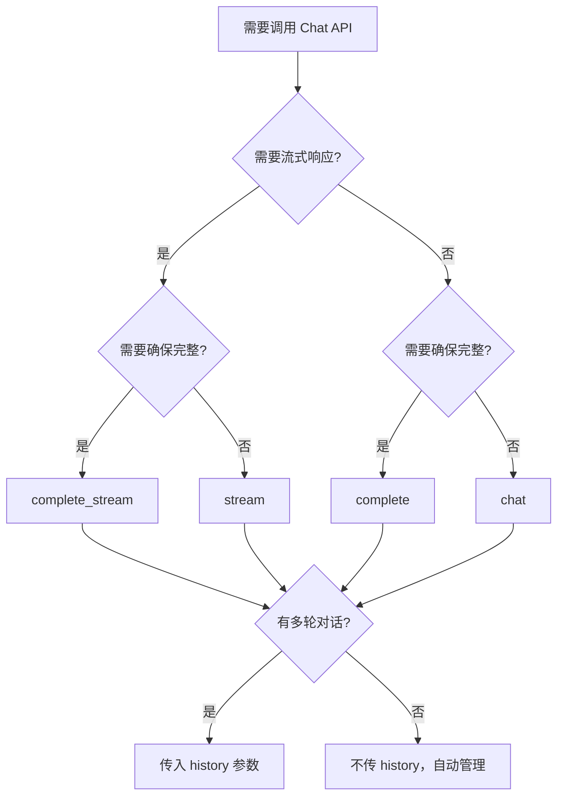

# Lexilux I01 改进设计文档

**日期**: 2026-02-08
**范围**: 修复 A01 代码评审中的 P0 和 P1 级别问题
**原则**: KISS、DRY、SOLID、YAGNI，无向后兼容包袱

---

## 1. 概述

### 1.1 目标

修复 A01 代码评审中识别的关键问题，提升 Lexilux 的生产就绪水平。

### 1.2 范围

| 优先级 | 问题 | 状态 |
|--------|------|------|
| P0-1 | 连接池被移除导致性能倒退 | 修复 |
| P0-2 | max_retries 参数未实现 | 修复 |
| P1-1 | StreamingIterator 资源管理 | 增强 |
| P1-2 | History Immutability 语义不一致 | 文档澄清 |
| P1-3 | 日志缺少敏感信息脱敏 | 修复 |

---

## 2. 架构设计

### 2.1 连接池恢复

使用 `requests.Session()` 替代直接调用 `requests.post()`，通过 `HTTPAdapter` 配置连接池。

**新增参数:**
```python
pool_size: int = 2  # 连接池大小（保守默认，避免触发 provider 限制）
```

**内部实现:**
```python
self._session = requests.Session()
adapter = requests.adapters.HTTPAdapter(
    pool_connections=pool_size,
    pool_maxsize=pool_size,
)
self._session.mount("http://", adapter)
self._session.mount("https://", adapter)
```

**默认值说明:**
- 默认值为 2，避免触发 LLM provider 的并发连接限制
- 用户可根据需要调整（OpenAI 建议 ≤10，Anthropic 建议 ≤5）

### 2.2 重试逻辑集成

使用 `tenacity` 库实现指数退避重试。

**新增依赖:**
```toml
dependencies = [
    "requests>=2.32.0",
    "httpx>=0.27.0",
    "tenacity>=9.0.0",  # 新增
]
```

**重试策略:**
- 指数退避: `0.1s * (2 ** attempt)`
- 随机抖动: `0 ~ 0.1s`
- 最大延迟: `60s`

**重试条件:**
- `e.retryable == True` 的 Lexilux 异常
- 包括: RateLimitError, ServerError, TimeoutError, ConnectionError

---

## 3. 组件设计

### 3.1 BaseAPIClient 改造

**构造函数变更:**
```python
def __init__(
    self,
    *,
    base_url: str,
    api_key: str | None = None,
    timeout_s: float = 60.0,
    connect_timeout_s: float | None = None,
    read_timeout_s: float | None = None,
    max_retries: int = 0,
    headers: dict[str, str] | None = None,
    proxies: dict[str, str] | None = None,
    pool_size: int = 2,  # 新增
):
```

**请求方法重构:**

将 `_make_request()` 拆分为：
- `_make_request()`: 重试包装器
- `_do_request()`: 实际执行请求的方法（被 tenacity 装饰）

```python
from tenacity import (
    retry,
    stop_after_attempt,
    wait_exponential,
    wait_random,
    retry_if_exception,
    before_sleep_log,
)

def _get_retry_decorator(self, max_attempts: int):
    """获取重试装饰器"""
    return retry(
        stop=stop_after_attempt(max_attempts),
        wait=wait_exponential(multiplier=0.1, min=0.1, max=60) + wait_random(0, 0.1),
        retry=retry_if_exception(lambda e: isinstance(e, LexiluxError) and e.retryable),
        before_sleep=before_sleep_log(logger, logging.DEBUG),
    )

@retry
def _do_request(self, endpoint: str, payload: dict) -> requests.Response:
    """执行请求（可被重试）"""
    url = f"{self.base_url}/{endpoint}"
    return self._session.post(
        url,
        json=payload,
        timeout=self.timeout,
        headers=self.headers,
        proxies=self.proxies,
    )

def _make_request(self, endpoint: str, payload: dict) -> requests.Response:
    """发起请求（带重试）"""
    try:
        return self._do_request(endpoint, payload)
    except requests.exceptions.RequestException as e:
        raise self._map_exception(e)
```

### 3.2 日志脱敏工具

```python
from urllib.parse import urlparse, parse_qs, urlencode

def _sanitize_for_logging(
    self,
    url: str,
    headers: dict[str, str] | None = None,
) -> tuple[str, dict[str, str] | None]:
    """
    脱敏 URL 和 headers 中的敏感信息。

    Returns:
        (sanitized_url, sanitized_headers)
    """
    # URL 脱敏
    parsed = urlparse(url)
    sanitized_query = []
    sensitive_params = {'api_key', 'token', 'password'}

    for key, values in parse_qs(parsed.query).items():
        if key.lower() in sensitive_params:
            sanitized_query.append((key, '***'))
        else:
            sanitized_query.append((key, values[0]))

    sanitized_url = parsed._replace(
        query=urlencode(sanitized_query)
    ).geturl()

    # Headers 脱敏
    if headers:
        sensitive_headers = {
            'authorization', 'cookie', 'set-cookie',
            'x-api-key', 'x-auth-token',
        }
        sanitized_headers = {
            k: '***' if k.lower() in sensitive_headers else v
            for k, v in headers.items()
        }
    else:
        sanitized_headers = None

    return sanitized_url, sanitized_headers
```

### 3.3 StreamingIterator 清理日志

```python
def _chunk_generator() -> Iterator[ChatStreamChunk]:
    """Internal generator for streaming chunks."""
    parser = SSEChatStreamParser(
        return_raw_events=return_raw_events,
        include_reasoning=include_reasoning,
    )
    try:
        for line in response.iter_lines():
            if not line:
                continue
            try:
                line_str = line.decode("utf-8")
            except UnicodeDecodeError:
                continue
            chunk = parser.feed_line(line_str)
            if chunk is None:
                continue
            yield chunk
            if parser.done:
                break
    finally:
        logger.debug("Closing streaming response and releasing connection")
        response.close()
```

---

## 4. 数据流设计

### 4.1 非流式请求流程

```
用户调用 Chat.__call__()
    ↓
Chat._build_payload() → 构建请求体
    ↓
BaseAPIClient._make_request()
    ↓
BaseAPIClient._do_request() [带 tenacity 重试]
    ↓
  - 检查响应状态
  - 成功: 返回 response
  - 失败: 抛出 LexiluxError (带 retryable 标志)
    ↓
如果重试次数用尽，重新抛出异常
    ↓
parse_chat_completion_response() → 解析响应
    ↓
返回 ChatResult
```

### 4.2 流式请求流程

```
用户调用 Chat.stream()
    ↓
Chat._build_payload() → stream=True
    ↓
BaseAPIClient._make_streaming_request()
    ↓
返回 response 对象
    ↓
StreamingIterator.__iter__()
    ↓
_chunk_generator():
    try:
        for line in response.iter_lines():
            yield chunk
    finally:
        logger.debug("Closing streaming response")
        response.close()
```

---

## 5. 错误处理设计

### 5.1 异常映射

将 `requests` 异常映射到 Lexilux 异常体系：

```python
def _map_exception(self, exc: requests.exceptions.RequestException) -> LexiluxError:
    """将 requests 异常映射到 Lexilux 异常"""
    if isinstance(exc, requests.exceptions.Timeout):
        return TimeoutError(str(exc))
    elif isinstance(exc, requests.exceptions.ConnectionError):
        return ConnectionError(str(exc))
    else:
        return NetworkError(str(exc))
```

### 5.2 重试条件

只有满足以下条件的异常才会触发重试：
- `e.retryable == True` 的 Lexilux 异常
- 可重试的异常类型：RateLimitError, ServerError, TimeoutError, ConnectionError

---

## 6. 测试设计

### 6.1 单元测试

**连接池测试:**
```python
def test_session_with_connection_pool():
    """验证 Session 正确配置连接池"""
    client = BaseAPIClient(
        base_url="https://api.example.com",
        pool_size=20,
    )
    assert isinstance(client._session, requests.Session)
    adapter = client._session.get_adapter("https://api.example.com")
    assert isinstance(adapter, requests.adapters.HTTPAdapter)
    assert adapter._pool_connections == 20
    assert adapter._pool_maxsize == 20
```

**重试逻辑测试:**
```python
def test_retry_on_retryable_error():
    """验证可重试异常会触发重试"""
    with patch.object(client, '_do_request') as mock_request:
        mock_request.side_effect = [
            RateLimitError("Rate limited"),
            MockResponse(status_code=200),
        ]
        response = client._make_request("test", {})
        assert mock_request.call_count == 2

def test_no_retry_on_non_retryable_error():
    """验证不可重试异常不触发重试"""
    with patch.object(client, '_do_request') as mock_request:
        mock_request.side_effect = AuthenticationError("Invalid key")
        with pytest.raises(AuthenticationError):
            client._make_request("test", {})
        assert mock_request.call_count == 1
```

**日志脱敏测试:**
```python
def test_log_sanitization_url():
    """验证 URL 中的敏感参数被脱敏"""
    client = BaseAPIClient(base_url="https://api.example.com")
    url = "https://api.example.com?api_key=secret&other=value"
    sanitized, _ = client._sanitize_for_logging(url)
    assert "api_key=***" in sanitized
    assert "secret" not in sanitized
    assert "other=value" in sanitized

def test_log_sanitization_headers():
    """验证敏感 headers 被脱敏"""
    client = BaseAPIClient(base_url="https://api.example.com")
    headers = {"Authorization": "Bearer secret", "Content-Type": "application/json"}
    _, sanitized = client._sanitize_for_logging("", headers)
    assert sanitized["Authorization"] == "***"
    assert sanitized["Content-Type"] == "application/json"
```

### 6.2 集成测试

**StreamingIterator 资源清理:**
```python
def test_streaming_cleanup_on_early_exit():
    """验证迭代器提前退出时资源被清理"""
    with patch('lexilux.chat.client.logger') as mock_logger:
        iterator = chat.stream("test")
        for i, chunk in enumerate(iterator):
            if i == 2:
                break  # 提前退出

        # 验证清理日志被记录
        mock_logger.debug.assert_any_call(
            "Closing streaming response and releasing connection"
        )
```

### 6.3 性能基准测试

**连接池性能对比:**
```python
@pytest.mark.benchmark
def test_connection_pool_performance(benchmark):
    """对比有/无连接池的性能"""
    client_with_pool = Chat(
        base_url="...",
        api_key="...",
        pool_size=10
    )

    def make_requests():
        for _ in range(100):
            client_with_pool("hello")

    result = benchmark(make_requests)
    # 应该显著快于无连接池版本
```

---

## 7. 实现计划

### 7.1 任务分解

| 任务 | 文件 | 优先级 | 预计复杂度 |
|------|------|--------|------------|
| 添加 tenacity 依赖 | `pyproject.toml` | P0 | 简单 |
| 连接池参数和初始化 | `lexilux/_base.py` | P0 | 中等 |
| 重构请求方法 | `lexilux/_base.py` | P0 | 中等 |
| 异步方法重试集成 | `lexilux/_base.py` | P0 | 中等 |
| 异常映射和重试集成 | `lexilux/_base.py` | P0 | 中等 |
| 日志脱敏工具 | `lexilux/_base.py` | P1 | 简单 |
| StreamingIterator 清理日志 | `lexilux/chat/client.py` | P1 | 简单 |
| 单元测试 | `tests/test_base.py` | P0 | 中等 |
| 集成测试 | `tests/integration/` | P0 | 中等 |
| 性能基准测试 | `benchmarks/` | P1 | 简单 |
| 文档更新 | `docs/`, `README.md` | P1 | 简单 |

### 7.2 实现顺序

```
1. 添加依赖和基础结构
   └─> pyproject.toml: 添加 tenacity

2. BaseAPIClient 改造
   ├─> 连接池初始化
   ├─> 请求方法重构（同步和异步）
   ├─> 异常映射
   └─> 日志脱敏

3. Chat 客户端适配
   └─> StreamingIterator 日志

4. 测试实现
   ├─> 单元测试
   ├─> 集成测试
   └─> 性能基准测试

5. 文档更新
   ├─> API 变更说明
   ├─> History Immutability 澄清
   └─> README 流程图
```

---

## 8. 文档更新

### 8.1 API 变更说明

**BaseAPIClient 新增参数:**
```python
pool_size: int = 2  # 连接池大小（默认: 2）
```

**max_retries 行为变更:**
- 之前：参数被接受但未实现
- 之后：使用 tenacity 实现指数退避重试

**文档说明:**
```markdown
**pool_size**: 连接池大小（默认: 2）

大多数用户使用默认值即可。如需高并发，可根据 API provider 的限制调整：
- OpenAI: 建议不超过 10
- Anthropic: 建议不超过 5
- 其他 provider: 请查阅文档确认限制
```

### 8.2 History Immutability 契约澄清

在 README 和 API 文档中明确说明：

| 方法 | History 行为 | 说明 |
|------|--------------|------|
| `chat()` | 只读 | 不修改传入的 history |
| `stream()` | 只读 | 不修改传入的 history |
| `complete()` | 内部工作副本 | 创建内部副本，不修改原始 history |

### 8.3 API 选择流程图



---

## 9. 验收标准

- [ ] 连接池正常工作，单元测试通过
- [ ] 重试逻辑按预期工作，可重试异常触发重试
- [ ] 日志脱敏正确，敏感信息不泄露
- [ ] StreamingIterator 资源清理有日志记录
- [ ] 性能基准测试显示连接池带来性能提升
- [ ] 文档更新完整，History 契约清晰
- [ ] 所有测试通过，覆盖率保持 68% 以上
